# 前言
最近在论坛里看到了很多vmp定位and、shr来修改标志位结果爆破jcc从而执行分支路径的方法，然后我联想到在正常程序中符号执行也能完成路径探索从而找到各个分支的路径谓词，就拓展思路，把符号执行应用到vmp上让它也能找出vmp里的分支路径，原理并不难理解，基于此我写下了这篇文章来分享。

# 思路步骤
## 1. 收集 trace
我用以下 c++ 代码来演示，在vs2022用release x64编译:
```cpp
#include <iostream>
#include <Windows.h>

#include "VMProtectSDK.h"

void test(unsigned x) {
    VMProtectBegin("secret");
    if (x == 0xDEADBEEF) { // 3735928559
        MessageBoxA(NULL, "DEADBEEF", "", MB_OK);
    }
    VMProtectEnd();
}

int main(int ac, const char* av[]) {
    unsigned x = 0;
    printf("x: ");
    scanf("%d", &x);
    test(x);
    
    return 0;
}
```
接着用 vmp 3.4 来加壳保护，函数选项设置为`超级(变异 + 虚拟)`，文件保护选项均默认选择`是`
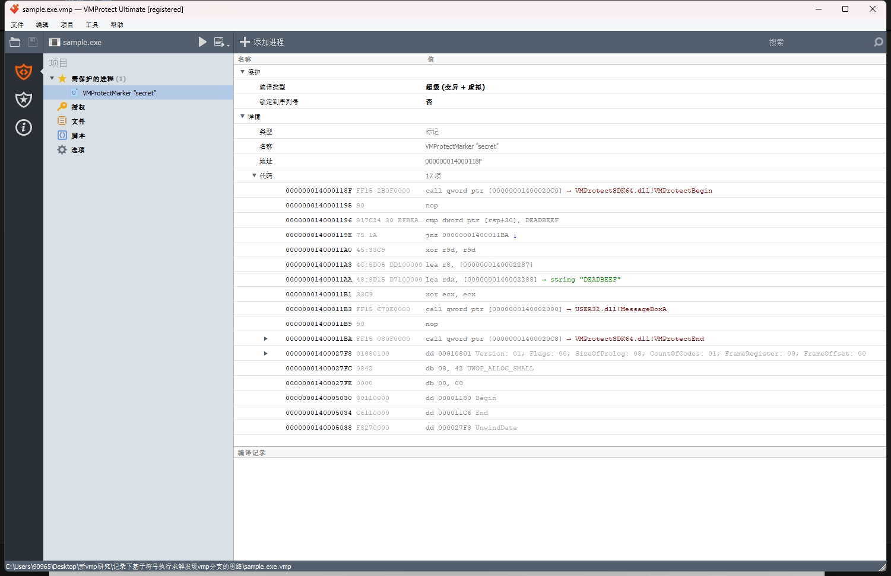
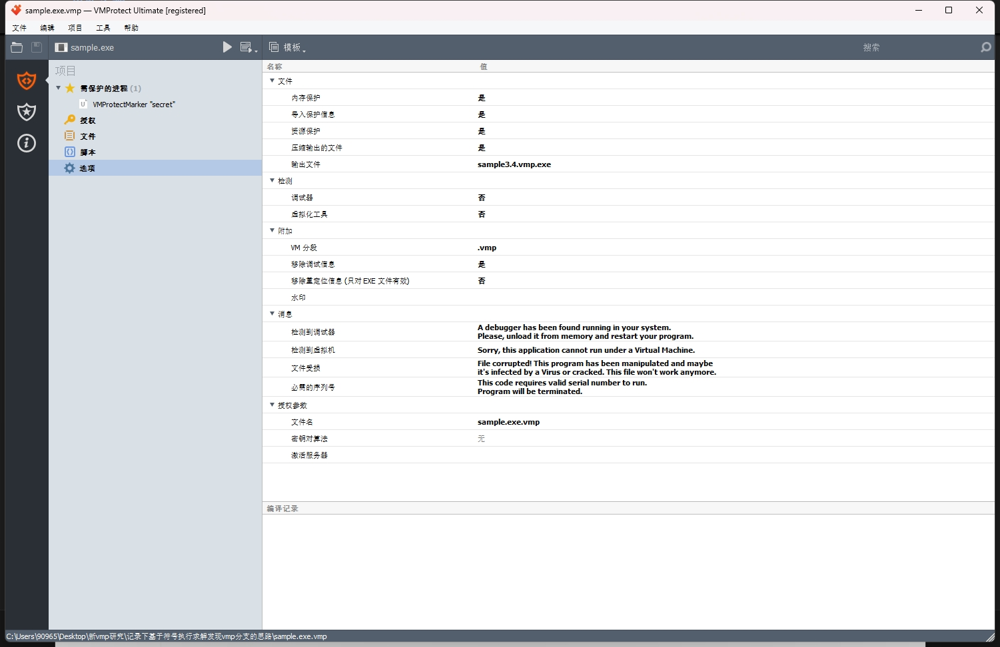

然后使用 x64dbg 的追踪功能来记录被vm函数的完整指令追踪记录，先找到vm函数，在vm函数的开头和结尾处下断点，然后开启x64dbg的跟踪，等到结尾处的断点被命中后就可以关闭跟踪得到完整的trace文件。
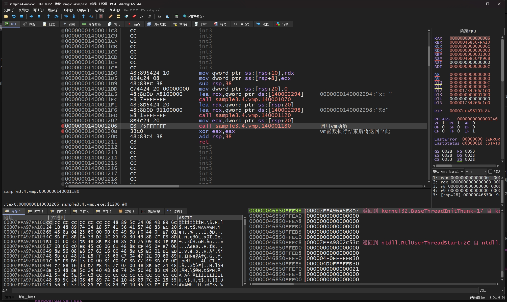
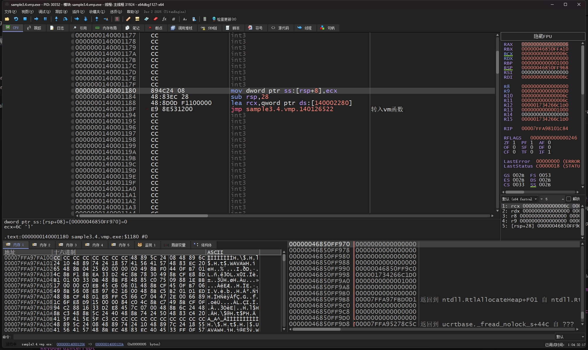
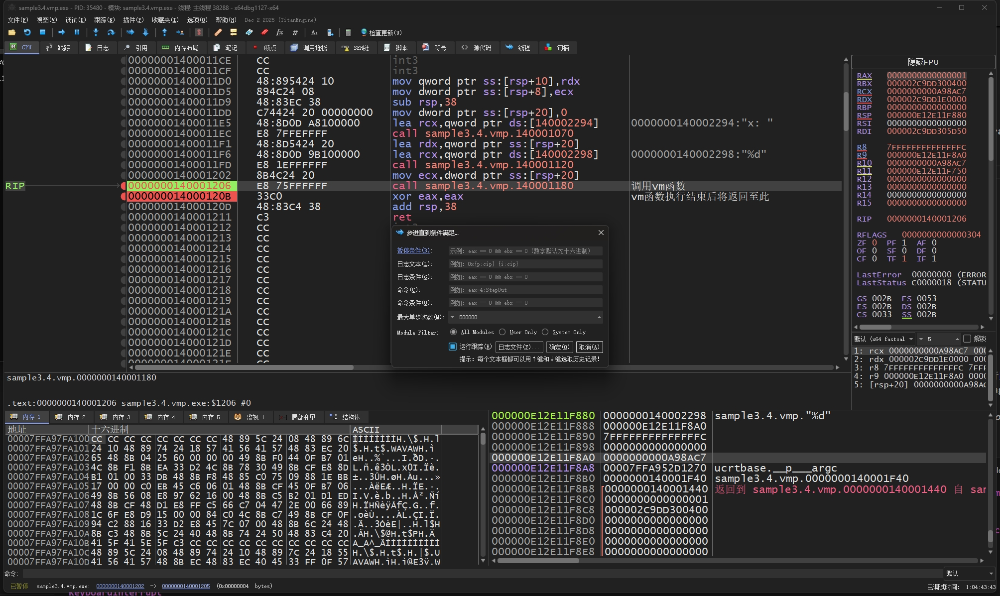

为了防止 x64dbg 把 MessageBoxA 的指令也给记录到trace里来，我把 MessageBoxA 的开头处指令改成了 ret，这时信息框将不会弹出。  
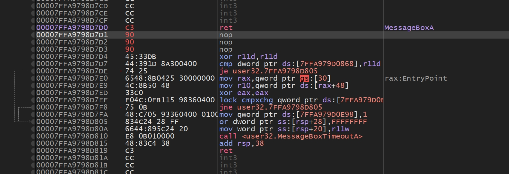

我在这里跟踪出两份trace，分别是输入x为 `11111111` 和 `3735928559` 的 `11111111.trace64` 文件和 `deadbeef.trace64` 文件  
注意看，每个trace的第一条指令的rcx寄存器就是所输入x的值：
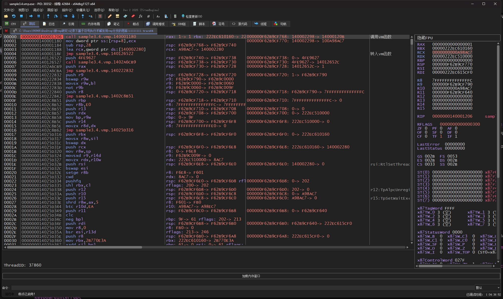
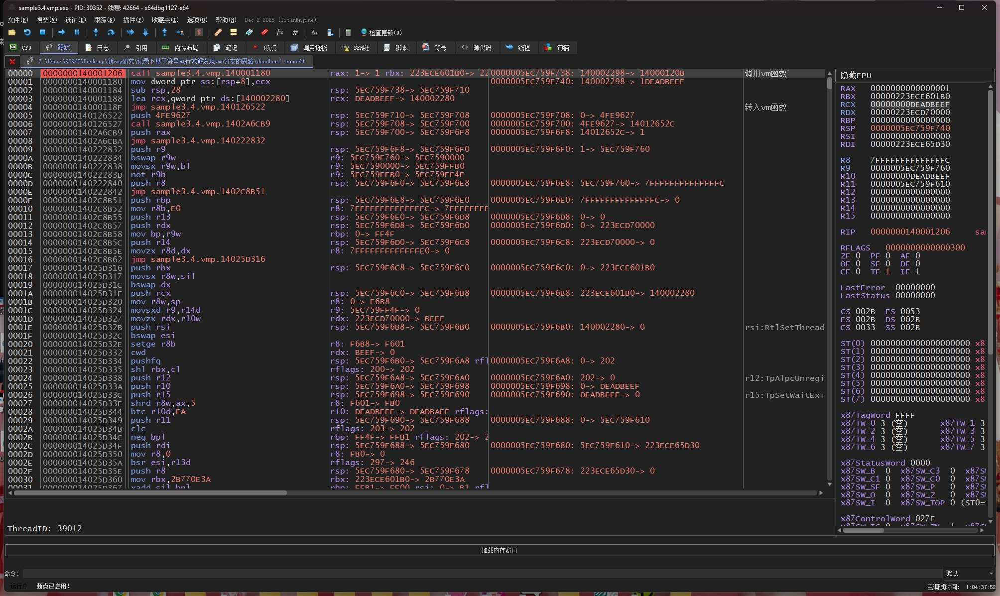

顺带一提，为了进行信息更全面充分的trace分析，我也开发了基于x64dbg的插件 **supertrace** 和对应的python绑定 **supertrace-pybind**，它可在用户开启跟踪之时自动在trace文件中写入内存、线程、模块等即时信息，接着就可以通过 **supertrace-pybind** 在python代码下解析原始指令跟踪信息以及由supertrace追加的额外信息（再搭配ipynb做研究就非常舒适了）:  
- [https://github.com/g0th1c54e4/supertrace](https://github.com/g0th1c54e4/supertrace)  
- [https://github.com/g0th1c54e4/supertrace-pybind](https://github.com/g0th1c54e4/supertrace-pybind)

## 2. 思路分析
下面我用 triton 作为符号执行引擎（因为 triton 用起来比 angr 感觉会更自由点，miasm 的话我没用过不知道它是怎么样的）  

首先说vmp的handler执行原理，一个handler先从vm区块（vip）里读取下一个handler的偏移字节码，然后把它与 vkey 进行滚轮解密，最后再将解密后的偏移量与当前的handler地址相加，用间接跳转指令进行跳转。
也就是说，handler的执行都是一个一个间接跳转去跳转执行，那么说到vmp分支，分支路径的执行就肯定也是从间接跳转指令进行分岔，我们可以拿 "执行MessageBoxA" 和 "不执行MessageBoxA" 的trace的间接跳转做个对比。  

***这里说个解混淆的技巧，如果间接跳转的目标地址不是从vm区块里来的（也就是跳转地址的运算数值组成中没有来自vm区块的数据），就肯定是用混淆做的，可以根据这一点用污点传播这类手法把它们识别出来，刚好triton不仅有符号引擎，也有污点引擎***


```python
import triton
import SupertracePybind as Supertrace
from supertrace_util import compatibleProcessing, initTritonCtxEnv, mergeRepeatIns, checkIndirectIns

tracepath = "11111111.trace64"
#tracepath = "deadbeef.trace64"

trace = Supertrace.parse_x64dbg_trace(tracepath)
record = trace.getRecord() # 获取trace的记录指令列表
print(f"trace instruction num: {len(record)}")

modules = trace.user.meta.getModules()
for mod in modules:
    if mod.isMainModule:
        main_module = mod
        break

main_secs = main_module.getSections()
print("No\tName")
for i, sec in enumerate(main_secs):
    print(f"{i}\t{sec.name}")
'''
No	Name
0	.text
1	.rdata
2	.data
3	.pdata
4	.vmp0
5	.vmp1
6	.reloc
7	.rsrc
'''

vmpsec_begin = main_secs[4].addr # vm区块的起始地址
vmpsec_end = main_secs[6].addr # vm区块的截止地址
print(f"vmp begin: {hex(vmpsec_begin)}")
print(f"vmp end: {hex(vmpsec_end)}")

ctx = triton.TritonContext()
ctx.setArchitecture(triton.ARCH.X86_64)
ctx.setMode(triton.MODE.ALIGNED_MEMORY, True)
ctx.setMode(triton.MODE.AST_OPTIMIZATIONS, True)
ctx.setMode(triton.MODE.CONSTANT_FOLDING, True)
ctx.setMode(triton.MODE.ONLY_ON_TAINTED, True)
ctx.setMode(triton.MODE.TAINT_THROUGH_POINTERS, True) # 开启内存指针污染

record = mergeRepeatIns(ctx, record, True) # 合并trace里的rep指令
print(f"after mergeing 'rep' instructions, trace instruction num: {len(record)}")

threads = trace.user.meta.getThreads()
for th in threads:
    if th.id == record[0].thread_id:
        main_thread = th
        break
print(f"main thread id: {main_thread.id} ({hex(main_thread.id)})")
print(f"teb: {hex(main_thread.teb)}") # 获取线程TEB地址
initTritonCtxEnv(ctx, record[0], main_thread.teb) # 初始化寄存器环境

for i, ins in enumerate(record):
    if (i + 1 >= len(record)): nextIns = None
    else: nextIns = record[i + 1]

    ttins = triton.Instruction()
    ttins.setAddress(ins.ins_address)
    ttins.setOpcode(ins.bytes)
    ctx.disassembly(ttins)

    for memAcc in ins.mem_accs:
        if (memAcc.type == Supertrace.AccessType.READ and (vmpsec_begin <= memAcc.acc_address <= vmpsec_end)):
            ctx.taintMemory(triton.MemoryAccess(memAcc.acc_address, memAcc.acc_size)) # 污染来自VM区块的字节码（确保不会把混淆间接跳转也给识别进去）

    compatibleProcessing(ctx, ttins, ins, nextIns, True, False) # 执行指令

    if (checkIndirectIns(ttins) and (nextIns is not None) and ttins.isTainted()):
        jumpAddr = nextIns.ins_address
        print(f"{hex(ins.dbg_id)}\t{ttins.getDisassembly()}\t\t{hex(jumpAddr)}") # 打印指令序号、指令反汇编文本以及对应的跳转地址
```

用这段代码分别给 `11111111.trace64` 和 `deadbeef.trace64` 进行分析，把控制台输出结果保存到txt里，再用WinMerge进行差异对比
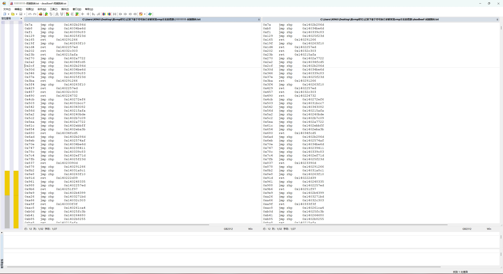
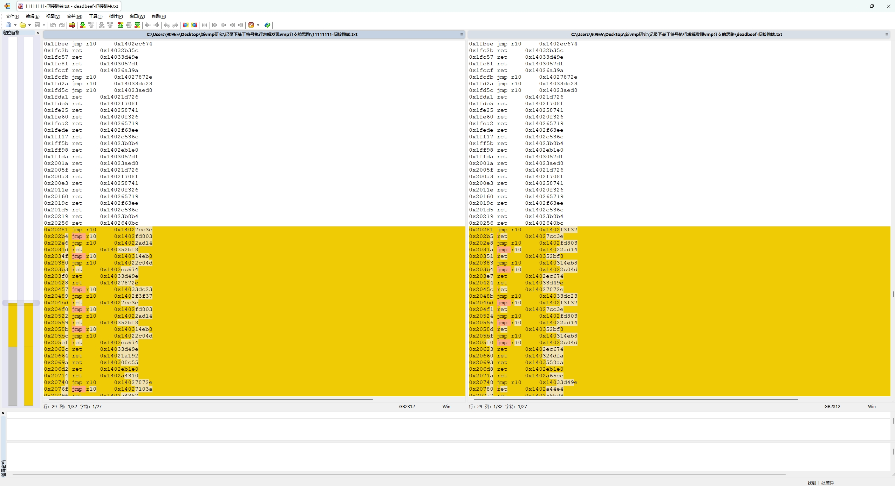
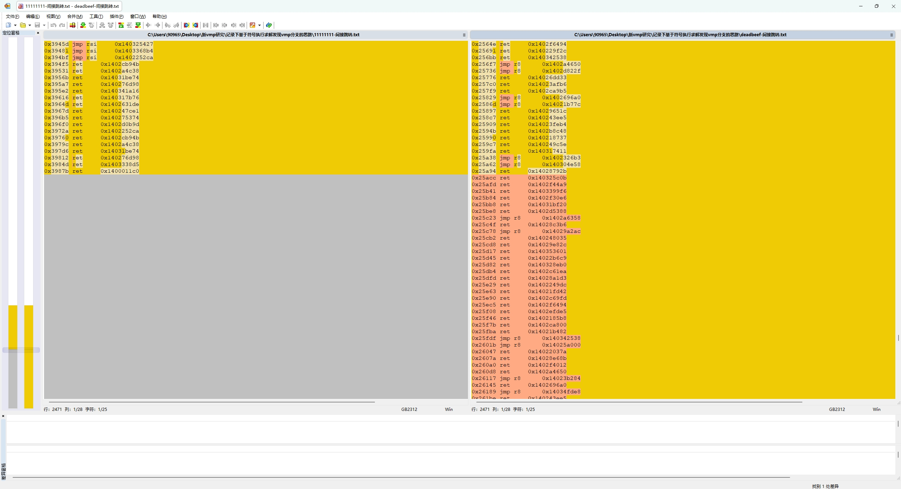
可以看到，这两份trace的间接跳转指令和跳转地址在前部分是相同的，但两份trace到了第0x20281处的时候，跳转地址就开始变不一样了，而在它之后的指令和跳转地址也都变了。  
这说明 0x20281 处就是一处vmp分支，vmp在这里分叉了"执行MessageBoxA"和"不执行MessageBoxA"这两条路径，而为什么会在这里发生分叉，肯定就是因为输入参数x的不同，导致选择分支路径的布尔值不同。 
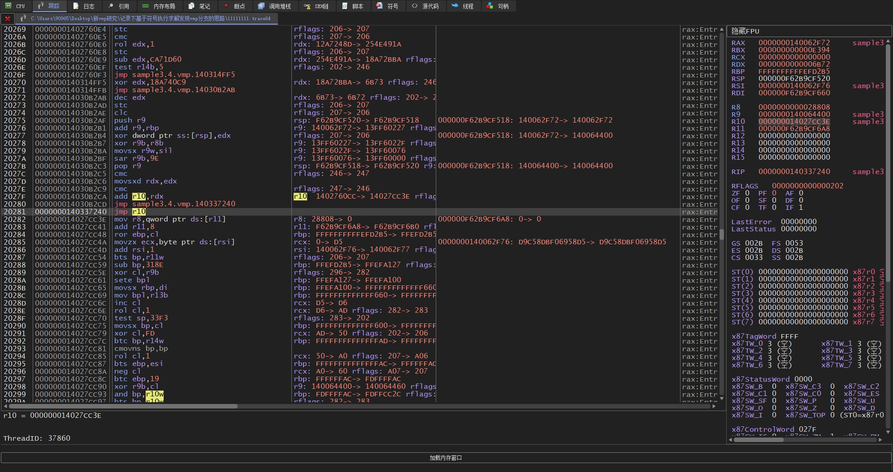
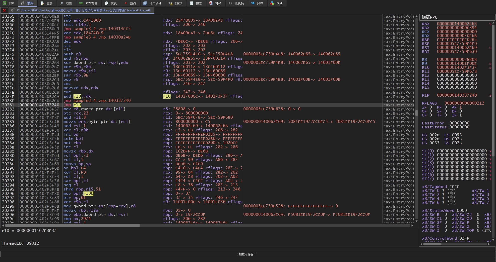

到这里，思路就明确了，我们可以把输入参数x给符号化（Sym_X），然后在triton中把trace里的每条记录指令都一个个processing，跟踪一下哪些间接跳转指令被符号化了（具体来说，就是判断跳转地址的AST节点里是否包含 Sym_X 这一符号变量）。如果检测出某个间接跳转被符号化，就试着求出 Sym_X 是否存在某个取值，使得当前间接跳转的目标地址不再等于trace所记录的目标地址，如果有解就是分支(SAT)，否则不是分支(UNSAT)，这一过程可以交给SMT求解器来完成（triton 里用 z3 或 Bitwuzla）。

比如我们回看上面 `11111111.trace64` 与 `deadbeef.trace64` 的对比，"执行MessageBoxA"的地址是 **0x1402f3f37**，而"不执行MessageBoxA"的地址是 **0x14027cc3e**。以`11111111.trace64`的视角来看，我们的求解表达式则应该是 `jumpAst != 0x14027cc3e`。

## 3. 测试
因为 trace 刚好都在vm函数里，指令全部都是在vm区块里，就不额外判断间接跳转是否位于vm区块里了。

```python
import triton
import SupertracePybind as Supertrace
from supertrace_util import compatibleProcessing, initTritonCtxEnv, mergeRepeatIns, checkIndirectIns

tracepath = "11111111.trace64"

trace = Supertrace.parse_x64dbg_trace(tracepath)
record = trace.getRecord() # 获取trace的记录指令列表
print(f"trace instruction num: {len(record)}")

ctx = triton.TritonContext()
ctx.setArchitecture(triton.ARCH.X86_64)
ctx.setMode(triton.MODE.ALIGNED_MEMORY, True)
ctx.setMode(triton.MODE.AST_OPTIMIZATIONS, True)
ctx.setMode(triton.MODE.CONSTANT_FOLDING, True)
ctx.setMode(triton.MODE.ONLY_ON_SYMBOLIZED, True)
ctx.setMode(triton.MODE.SYMBOLIZE_INDEX_ROTATION, True)

# 开启 QF_ABV 逻辑，否则为 QF_BV 逻辑
# ctx.setMode(triton.MODE.MEMORY_ARRAY, True)
# ctx.setMode(triton.MODE.SYMBOLIZE_LOAD, True)
# ctx.setMode(triton.MODE.SYMBOLIZE_STORE, True)

astctx = ctx.getAstContext()

record = mergeRepeatIns(ctx, record, True) # 合并trace里的rep指令
print(f"after mergeing 'rep' instructions, trace instruction num: {len(record)}")

threads = trace.user.meta.getThreads()
for th in threads:
    if th.id == record[0].thread_id:
        main_thread = th
        break
print(f"main thread id: {main_thread.id} ({hex(main_thread.id)})")
print(f"teb: {hex(main_thread.teb)}")
initTritonCtxEnv(ctx, record[0], main_thread.teb) # 初始化寄存器环境

for i, ins in enumerate(record):
    ttins = triton.Instruction()
    ttins.setAddress(ins.ins_address)
    ttins.setOpcode(ins.bytes)
    ctx.disassembly(ttins)
    if (i + 1 >= len(record)): nextIns = None
    else: nextIns = record[i + 1]

    if (ins.dbg_id == 0): # 在最开始处符号化输入参数x
        sym_x = ctx.symbolizeRegister(ctx.registers.ecx, "Sym_X")

    compatibleProcessing(ctx, ttins, ins, nextIns, True, False) # 执行指令

    if (checkIndirectIns(ttins)): # 判断是否是间接跳转
        ripExpr = ctx.getSymbolicRegister(ctx.registers.rip)
        if ((ripExpr is None) or (not ripExpr.isSymbolized())): # 判断是否被符号化（是否与 Sym_X 有关）
            continue
        ripAst = astctx.unroll(ripExpr.getAst()) # 展开AST节点

        # ripAst.evaluate(): 当前跳转地址
        satProve = (ripAst != astctx.bv(ripAst.evaluate(), ripAst.getBitvectorSize()))

        model = ctx.getModel(satProve, True)
        status = model[1]
        if (status == triton.SOLVER_STATE.SAT):
            print(f"[{hex(ins.dbg_id)}] 已证明成功! 求解时间: {model[2]} 模型: {model[0]}")
            break
        elif (status == triton.SOLVER_STATE.UNSAT):
            print(f"[{hex(ins.dbg_id)}] 证明失败 求解时间: {model[2]}")
        elif (status == triton.SOLVER_STATE.TIMEOUT):
            print(f"[{hex(ins.dbg_id)}] 证明过程已超时")
        elif (status == triton.SOLVER_STATE.OUTOFMEM):
            print(f"[{hex(ins.dbg_id)}] 证明过程内存消耗殆尽")
        elif (status == triton.SOLVER_STATE.UNKNOWN):
            print(f"[{hex(ins.dbg_id)}] 证明过程发生未知错误: {status}")
        else:
            print(f"[{hex(ins.dbg_id)}] 证明过程发生未知错误: {status}")
```
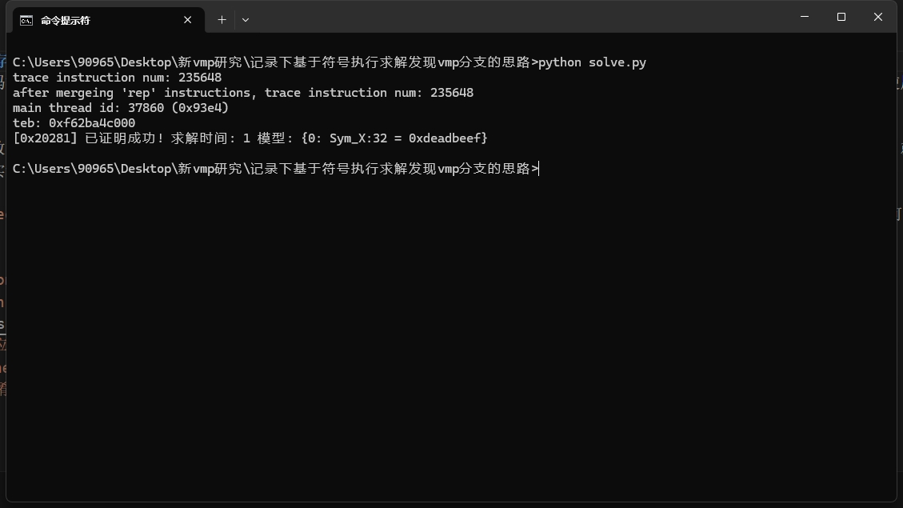

# 关于高版本的 VMP
上面用到的样本是用 vmp3.4 加壳的，实际上我也用过vmp 3.9.4来测试：
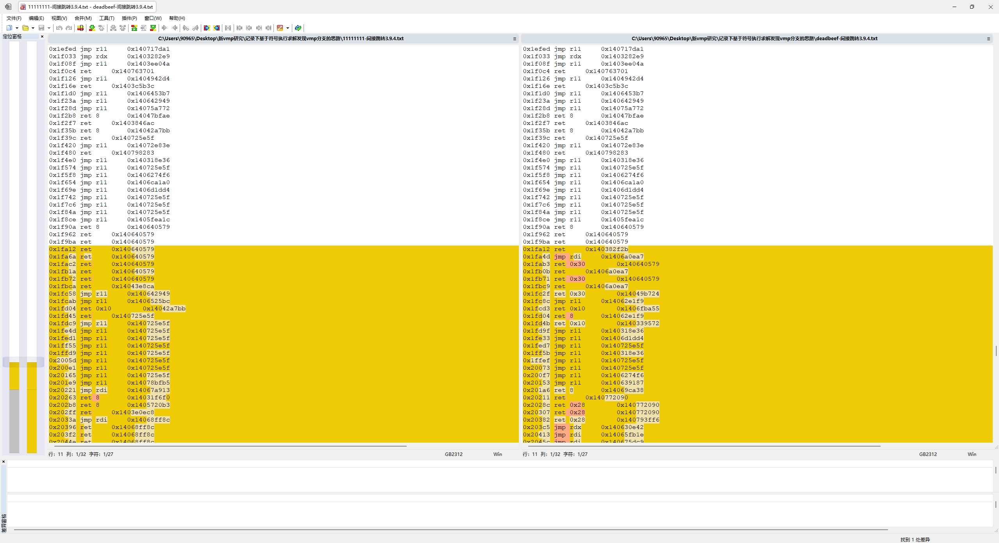
理论上是没问题的，只不过高版本的vmp似乎把混淆逻辑做到内存里了，类似下面的汇编代码模型（只是自己想象的可能的混淆模型）：  
这段代码的作用是判断A和B是否相等，从而选择是执行 0x11111111 还是 0x22222222，

```
mov esi, A ; 符号化为 Sym_A
mov eax, esi
mov esi, B ; 符号化为 Sym_B
sub eax, esi

pushfd
pop eax

and eax,0x40 ; 提取zf位
shr eax,6 ; 此时eax是1或0

sub esp,8
mov dword ptr ss:[esp+4], 0x11111111
mov dword ptr ss:[esp], 0x22222222
mov eax, dword ptr ss:[esp+eax*4] ; 通过eax的取值来选择分支路径
add esp, 8

call eax
```

也就是说这样就涉及到了**符号内存寻址问题**，简单来说就是 `mov eax, dword ptr ss:[esp+eax*4]` 里的内存操作数 `[esp+eax*4]` 涉及到符号变量，这会让SMT求解器更难去进行求解（求解器的性能消耗提高，且求解时间显著增长），而上面的代码没有开启 QF_ABV 逻辑（你可以理解成上面的求解代码没有"内存"这一概念），所以才为什么求解速度非常快。但如果直接使用 QF_BV 的话，你会发现一个被符号化的间接跳转都找不到。

```python
import triton
import keystone
import graphviz

ks = keystone.Ks(keystone.KS_ARCH_X86, keystone.KS_MODE_32)
def asmDecode(CODE: bytes) -> bytes:
    try:
        encoding, count = ks.asm(CODE)
        if (count <= 0):
            raise keystone.KsError
        return bytes(encoding)
    except keystone.KsError as e:
        print("ERROR: %s" %e)
        return b""

# 设置参数
a = 0x1234
b = 0x1235
f1 = 0x11111111
f2 = 0x22222222

codeStr = [
    f"mov esi, {hex(a)}", # 符号化为 Sym_A
    f"mov eax, esi",
    f"mov esi, {hex(b)}", # 符号化为 Sym_B
    f"sub eax, esi",

    f"pushfd",
    f"pop eax",

    f"and eax,0x40", # 提取zf位
    f"shr eax,6", # 此时eax是1或0

    f"sub esp,8",
    f"mov dword ptr ss:[esp+4], {hex(f1)}",
    f"mov dword ptr ss:[esp], {hex(f2)}",
    f"mov eax, dword ptr ss:[esp+eax*4]",
    f"add esp, 8",
    
    f"call eax"
]

code: list[bytes] = []

for idx, l in enumerate(codeStr):
    code.append(asmDecode(l))
    print(f"{idx}\t{l}")

'''
0	mov esi, 0x1234
1	mov eax, esi
2	mov esi, 0x1235
3	sub eax, esi
4	pushfd
5	pop eax
6	and eax,0x40
7	shr eax,6
8	sub esp,8
9	mov dword ptr ss:[esp+4], 0x11111111
10	mov dword ptr ss:[esp], 0x22222222
11	mov eax, dword ptr ss:[esp+eax*4]
12	add esp, 8
13	call eax
'''

ctx = triton.TritonContext()
ctx.setArchitecture(triton.ARCH.X86)
ctx.setAstRepresentationMode(triton.AST_REPRESENTATION.PYTHON)
ctx.setMode(triton.MODE.ALIGNED_MEMORY, True)
ctx.setMode(triton.MODE.AST_OPTIMIZATIONS, True)
ctx.setMode(triton.MODE.CONSTANT_FOLDING, True)
ctx.setMode(triton.MODE.ONLY_ON_SYMBOLIZED, True)
ctx.setMode(triton.MODE.MEMORY_ARRAY, True)
ctx.setMode(triton.MODE.SYMBOLIZE_LOAD, True)
ctx.setMode(triton.MODE.SYMBOLIZE_STORE, True)
ctx.setMode(triton.MODE.SYMBOLIZE_INDEX_ROTATION, True)
astctx = ctx.getAstContext()

def newLiftDot(expr_node) -> str:
    temp_ctx = triton.TritonContext()
    temp_ctx.setArchitecture(ctx.getArchitecture())
    return temp_ctx.liftToDot(expr_node)

for i, bys in enumerate(code):
    ttins = triton.Instruction()
    ttins.setOpcode(bys)

    ctx.processing(ttins)
    if (i == 0):
        ctx.symbolizeRegister(ctx.registers.esi, "Sym_A")
    if (i == 2):
        ctx.symbolizeRegister(ctx.registers.esi, "Sym_B")
    if (i == 11):
        memast = astctx.unroll(ctx.getRegisterAst(ctx.registers.eax)) # 获取内存操作数AST
        print(f"{memast}")

graphviz.Source(newLiftDot(memast))
```

在第11处时eax寄存器的AST图：  
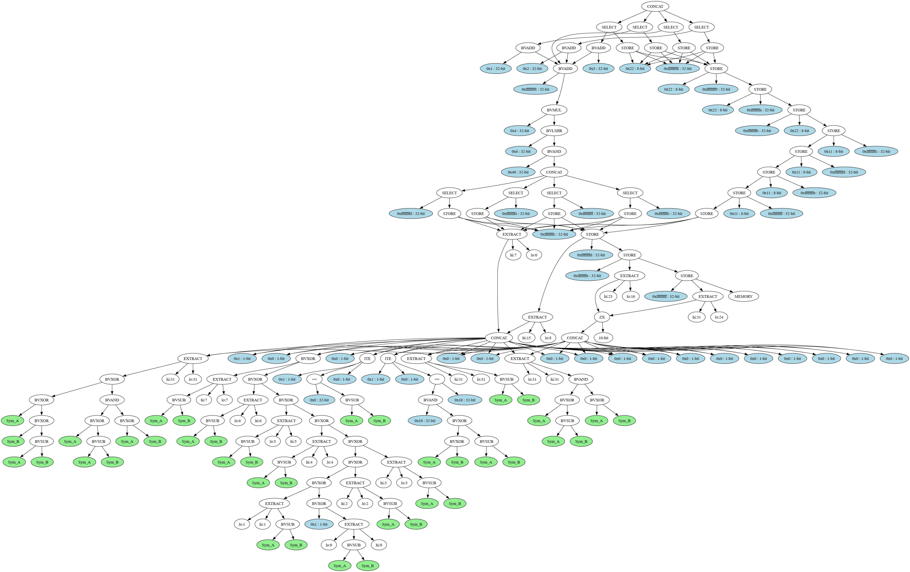

# 总结
原理总结起来，就是符号化输入参数，找出每个与输入参数有联系的跳转，用SMT求解器证明跳转的路径出口不等于 trace 中所记录的路径出口。如果证明成功，就说明输入参数存在某些取值可以使得跳转能够跳往其他路径，即这一处跳转就是一处分支。（说实话这实际上就是普通符号执行探索程序路径的概念）

这篇文章应该也可以当作 [VMProtect Devirtualization](https://github.com/JonathanSalwan/VMProtect-devirtualization) 里 Example 3 中如何识别vmp跳转的具体说明。

# 参考资料
- [VMProtect 3: Virtualization-Based Software Obfuscation Pt. 2](https://www.mitchellzakocs.com/blog/vmprotect3)  
- [VMProtect Devirtualization](https://github.com/JonathanSalwan/VMProtect-devirtualization)  
- [vmp 相关的问题](https://bbs.kanxue.com/thread-269976-1.htm)  
- [VMP3 的 jcc 简单分析及可能应用](https://bbs.kanxue.com/thread-255389-1.htm)  
- [vmp3.5模拟x86分支指令je、jne、jge和jl的分析](https://bbs.kanxue.com/thread-274637.htm)
- [看雪2021 SDC - 议题"代码混淆研究的新方向"](https://bbs.kanxue.com/thread-270019-1.htm)